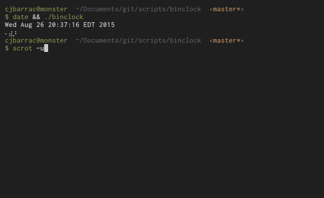

# binclock
binclock outputs the current time in binary clock format using unicode braille
characters

## Usage
Make sure that binclock is executable: `chmod +x binclock` and run it. It has
no special dependencies so it should work out of the box.

Run with python3

## Screenshot

