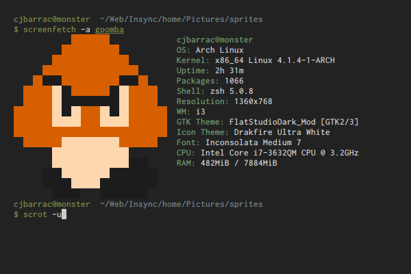
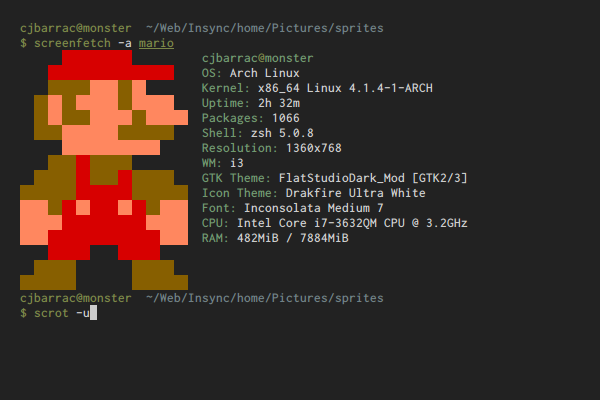

# img2sf
A script for generating a screenfetch ASCII file from an image.

## Usage
`img2sf <image> <path>`

Where `<image>` is a small image file, ideally with a width <= 32 pixels,

and `<path>` is the output path for the ASCII file.

## Dependencies
img2sf assumes that you have the `convert` and `img2xterm` binaries accessible from your path.

If you don't have `img2xterm` you can get it from the AUR or compile it from [source](https://github.com/kfei/img2xterm).

## Examples
Here are some examples of the script in action.

produces

produces

produces

produces

